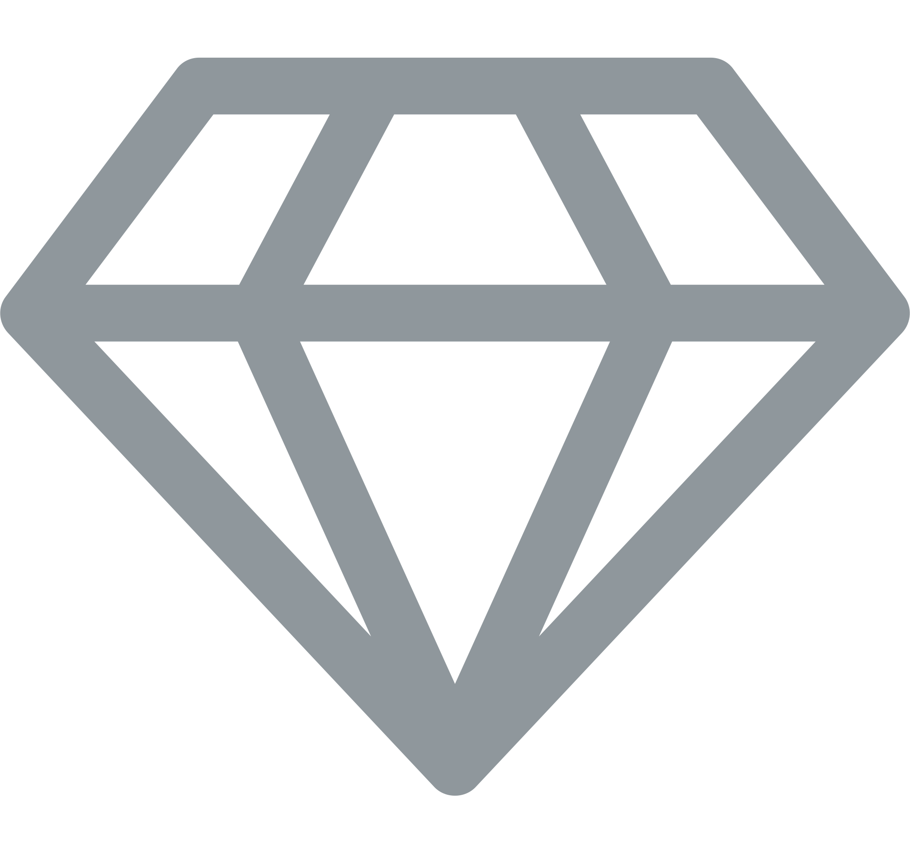

&nbsp;

Olá, meu nome é Davi  Sou Analista de Sistemas e Desenvolvedor apaixonado por tecnologia e sempre ansioso para enfrentar desafios emocionantes. Como alguém relativamente novo na área, estou constantemente comprometido com a aprendizagem e a expansão do meu conhecimento, especialmente por meio de projetos que integram conceitos de engenharia de software. Estou dedicado a extrair a máxima experiência de aprendizado, combinando habilidades técnicas com uma abordagem prática e buscando constantemente aprimorar minhas habilidades.

&nbsp;

&nbsp;&nbsp;&nbsp;
 

 
 &nbsp;
 &nbsp;

## Minhas Skills

#### Tecnologias principais:

&nbsp;
&nbsp;
&nbsp;
&nbsp;
&nbsp;

#### Tecnologias secundárias:

&nbsp;
&nbsp;
&nbsp;
&nbsp;
&nbsp;

#### Estudando no momento:

&nbsp;
&nbsp;
&nbsp;
&nbsp;

#### Databases:

&nbsp;
&nbsp;
&nbsp;
&nbsp;

#### Ferramentas de trabalho:

&nbsp;
&nbsp;
&nbsp;
&nbsp;
&nbsp;
&nbsp;

&nbsp;
&nbsp;

## Contatos:

 
-  Email: [davinascimentold.860@gmail.com](mailto:davinascimentold.860@gmail.com)
-  WhatsApp: [+55 (32) 98459-8541](https://wa.me/5532984598541)
-  Linked-in: [Davi Nascimento Rodrigues](https://www.linkedin.com/in/davi-nascimento-8045a1297/?profileId=ACoAAEfP4UQBTlt-s6FpRf9iS2G6dhbZmEgQbP4)
-  Discord: [ze_dark_860](#Discord)
-  Curriculo: [PDF](https://diegiwg.github.io/Diegiwg/public/Curriculo%20Diego%20Queiroz%20-%20v3.pdf)

&nbsp;&nbsp;

